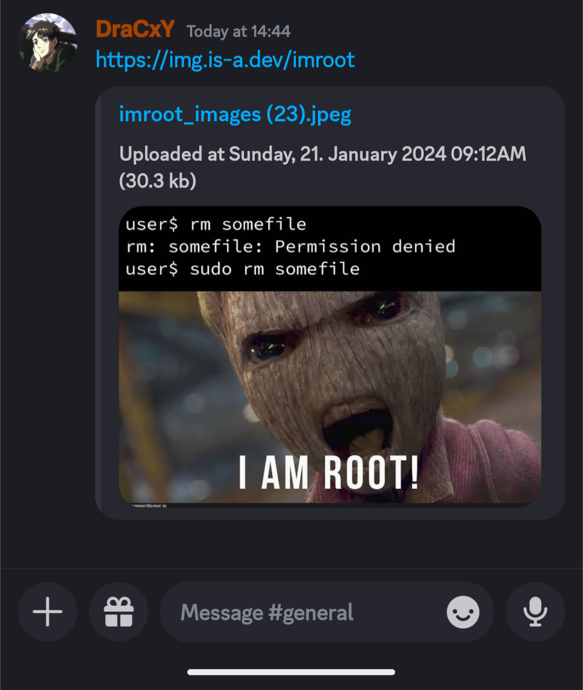

# ImgUP Fastapi image uploader

**Overview**

This is a simple image uploader application built with FastAPI as the backend and HTML, CSS, and JavaScript for the frontend. The application allows users to upload images and view them on the web interface.

**Requirements**

You can install the required dependencies using:

```bash
pip install -r requirements.txt
```

**How to Run**

To run the application, execute the following command in your terminal:

```bash
uvicorn main:app
```

Visit [http://localhost:8000](http://localhost:8000) in your web browser to access the application. If you want to change the port and host, you can use the following command:

```bash
uvicorn main:app --host 0.0.0.0 --port 3000
```

For development with automatic reloading, use the --reload option:

```bash
uvicorn main:app --reload
```

**Screenshots**




**Contribution**

Contributions are welcome! If you find any issues or have suggestions for improvement, please open an issue or create a pull request.


**License**

This project is licensed under the [MIT License](LICENSE). Feel free to use and modify the code as needed.
